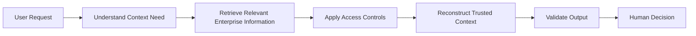

# ContextGuard — Permission-Aware Enterprise AI Agent

> Reconstructing trusted enterprise context without giving AI unrestricted access or decision authority.

🚧 **Ongoing — Tencent Cloud AI Singapore Hackathon 2026 · Aspire FinTech Track**

---

## Overview

ContextGuard is an ongoing enterprise AI project exploring how AI agents can reconstruct trusted decision context across fragmented workplace knowledge sources while respecting user permissions and keeping humans in control.

The project focuses on a common enterprise challenge:

> Important information is distributed across multiple tools, but not every employee is authorized to see the same information.

Instead of building a general enterprise chatbot, ContextGuard explores how an AI system can prepare the context humans need to make better decisions.

---

## Problem

In enterprise workflows, users often need to manually search across multiple systems before they can understand:

- what happened,
- what the current status is,
- which evidence is relevant,
- what information is still missing,
- and which policies or procedures apply.

This becomes especially difficult when information is:

- distributed across multiple workplace tools,
- frequently updated,
- permission-sensitive,
- and required for high-impact decisions.

---

## Product Direction

ContextGuard is designed around five principles:

### Permission-Aware AI

The system should respect the current user's access rights rather than treating all retrieved enterprise information as equally visible.

### Grounded Context Reconstruction

AI outputs should be supported by traceable enterprise evidence rather than generated from unsupported assumptions.

### Human-in-the-Loop

The AI can prepare context and suggest possible next steps, but final high-impact decisions remain with humans.

### Fresh Enterprise Context

The system should reflect relevant updates instead of relying on stale information.

### Auditable AI Workflows

Important AI actions should be traceable so teams can understand how the system reached an output.

---

## High-Level Workflow

The guiding product principle is:

> **AI prepares the decision context. Humans retain decision authority.**

---

## My Role

**Liu Weiqi — AI / System & Evaluation Lead**

My current focus includes:

- Agent workflow design
- Enterprise AI system architecture
- Secure context reconstruction
- AI system integration
- Evaluation framework design
- Reliability and safety testing
- Failure analysis

---

## Evaluation Direction

The project is being designed with evaluation as part of the product architecture rather than as a final demo-only step.

Current evaluation areas include:

- context reconstruction quality,
- grounding and citation quality,
- permission-sensitive behavior,
- reliability under difficult inputs,
- AI safety and guardrails,
- and business utility compared with manual context gathering.

Measured results will be added after the implementation and evaluation phases are complete.

---

## Current Status

🚧 **Active Development**

This public repository provides a high-level product case study while the project is under active competition development.

Detailed implementation, internal datasets, evaluation cases, permission configurations, and competition-specific technical design are currently kept private.

After the project is completed, this repository will be updated with:

- final architecture,
- product screenshots,
- demo materials,
- measured evaluation results,
- failure analysis,
- and key product learnings.

---

## Competition

**Tencent Cloud AI Singapore Hackathon 2026**  
**Aspire FinTech Track**

---

## Author

**Liu Weiqi**  
MSc in Artificial Intelligence for Enterprise @ NTU Singapore

[LinkedIn](https://www.linkedin.com/in/liu-weiqi/)
