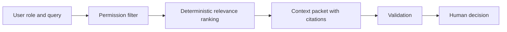

# ContextGuard — Permission-Aware Enterprise Context Reconstruction

> A small, executable case study showing how an AI workflow can retrieve useful enterprise context without exposing documents the current user cannot access.

🚧 **Ongoing — Tencent Cloud AI Singapore Hackathon 2026 · Aspire FinTech Track**

## What is public today

This repository now contains a deterministic minimum prototype rather than only a product concept. It demonstrates:

- permission filtering before retrieval;
- query-to-document relevance ranking;
- evidence citations for every returned item;
- safe handling when relevant evidence exists but is not visible;
- an explicit boundary that leaves high-impact decisions to a human.

The prototype does **not** connect to live enterprise systems, call an LLM, implement identity-provider authentication, or prove production security. It is public evidence of the intended control flow.

## Problem

Enterprise users often need to reconstruct what happened across several systems before making a decision. Relevant information can be fragmented, stale, and permission-sensitive. A useful assistant must retrieve enough evidence to help while preventing unauthorized context from entering the model prompt or answer.

## Prototype workflow



Run the public evaluation:

```bash
python evaluation/run_eval.py
```

The command executes the frozen cases in [`evaluation/cases.json`](evaluation/cases.json) and writes [`evaluation/results/latest.json`](evaluation/results/latest.json). No API key or network connection is required.

## Evidence

- [Architecture and data flow](docs/architecture.md)
- [Permission model and threat boundary](docs/permission-model.md)
- [Executable prototype](prototype/contextguard.py)
- [Synthetic document fixtures](prototype/fixtures/documents.json)
- [Frozen evaluation cases](evaluation/cases.json)
- [Recorded local result](evaluation/results/latest.json)

The fixtures are synthetic. Evaluation results measure only the deterministic public prototype; they are not results from the private competition system.

## My role

**Liu Weiqi — AI / System & Evaluation Lead**

My current focus includes agent workflow design, secure context reconstruction, system integration, evaluation design, reliability testing, and failure analysis. The public prototype is a limited evidence artifact for those design concerns; it should not be read as proof that the full competition system is complete.

## Current limitations

- Roles are supplied directly to the local function and are not authenticated.
- Permissions are document-level allowlists, not row-, field-, or attribute-level policies.
- Retrieval uses deterministic tag overlap rather than embeddings or a production search service.
- The fixture set is deliberately small and synthetic.
- Freshness is exposed as metadata but no connector currently refreshes documents.
- No generative answer is produced, so grounded generation and citation faithfulness are not yet measured.
- Human approval is represented as an output contract, not an integrated approval UI.

## Competition

**Tencent Cloud AI Singapore Hackathon 2026**  
**Aspire FinTech Track**

## Author

**Liu Weiqi**  
MSc in Artificial Intelligence for Enterprise @ NTU Singapore

[LinkedIn](https://www.linkedin.com/in/liu-weiqi/)

