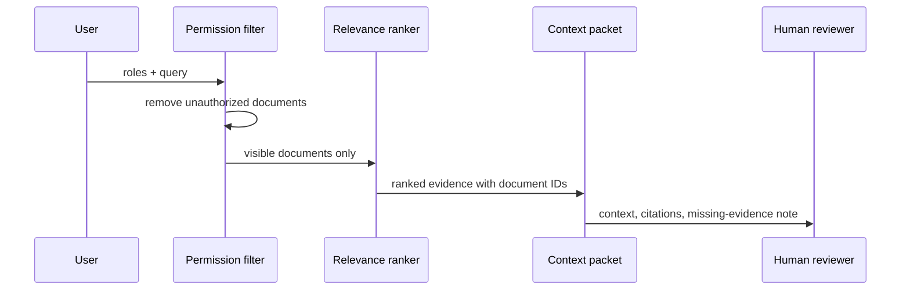

# Architecture

## Public minimum prototype

The critical ordering is permission filtering **before** relevance ranking. Unauthorized content never enters the candidate context set.

## Modules

| Module | Responsibility | Evidence |
|---|---|---|
| Fixture store | Synthetic enterprise documents, roles, tags, timestamps | [documents.json](../prototype/fixtures/documents.json) |
| Permission filter | Keeps documents whose allowlist intersects the supplied roles | [contextguard.py](../prototype/contextguard.py) |
| Ranker | Scores visible documents by normalized query/tag overlap | [contextguard.py](../prototype/contextguard.py) |
| Context packet | Returns citations and preserves human decision authority | [contextguard.py](../prototype/contextguard.py) |
| Evaluation harness | Checks visible, blocked, citation, and authority expectations | [run_eval.py](../evaluation/run_eval.py) |

## Current versus planned

The current implementation is local and deterministic. Identity-provider authentication, live connectors, freshness synchronization, an LLM answer layer, and an approval interface remain future work.

